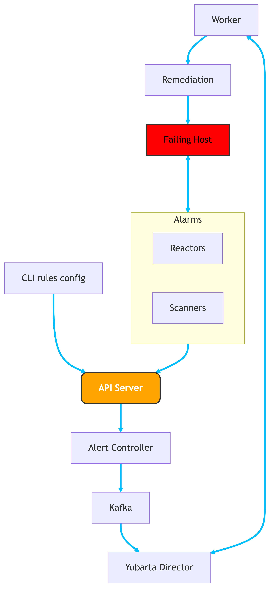

<h1>

  
  
Yubarta (y5a)

</h1>
  

    Automate your infrastructure recovery using eBPF signals and external alerts.
      
    <a href="#about">About</a>
    ·
    <a href="#key-features">Key Features</a>
    ·
    <a href="#roadmap">Roadmap</a>
    ·
    <a href="#architecture">Architecture</a>
    ·
    <a href="#documentation">Documentation</a>
  

## About

Yubarta is a distributed, event-driven auto-remediation platform that reacts to eBPF-based signals and external alerts with rule-based actions — all defined via simple YAML configs.

It’s designed for modern infrastructure teams that need automated response to system anomalies, without the overhead of managing agents or writing complex pipelines.

Yubarta doesn't just observe — it acts. Use it to move beyond dashboards and into self-healing systems.

### What It Does

Yubarta operates on two core pillars:

**1. eBPF Scanners**

Inject lightweight, kernel-level programs using eBPF to:

* Monitor performance (CPU, memory, syscalls, etc.)
* Profile specific services or containers
* Detect anomalies or behavior deviations

**2. Reactors (External Alerts)**

Ingest alerts from external systems like:

* Datadog
* Grafana
* Custom monitoring tools via API/Webhook

Once triggered, both scanners and reactors execute automated actions — such as restarting services, scaling resources, killing processes, or calling internal APIs.

> 🧪 Note: Yubarta is an early-stage project under active development. APIs and behavior may change — feedback and contributions are welcome!

## Key Features

🐝 Agentless eBPF program injection

📥 Alert ingestion from third-party tools like Datadog, Grafana, etc.

📂 Declarative rules with YAML

🔁 Automated remediations at fleet scale

🧩 Modular & extensible — bring your own actions

📋 Centralized alert store and pluggable decision engine

⚡ Asynchronous, event-driven architecture for high scalability

🔧 Declarative or SDK-based definitions for scans and remediations

## Roadmap

The feature-level plan for the project:

✅ Done

⏳ In Dev

🔜 Planned

💡 Idea

| Status   | Feature           | Description                                                                 |
|----------|-------------------|-----------------------------------------------------------------------------|
| ✅ | External Alert Ingestion | React to alerts from tools like Datadog or Grafana                  |
| ✅ | Kafka Backend     | Use Kafka for scalable alert and rule event processing                     |
| ⏳ | API Gateway layer   | Add Kong Gateway CE for rate limit and API security                          |
| ⏳ | YAML Rule Engine   | Define match conditions and actions declaratively                          |
| ⏳ | Director Component | Orchestrates rule matching and remediation decision logic                  |
| ⏳ | CLI Tool          | Manage rules and trigger actions from the command line                     |
| 🔜 | eBPF Scanners     | Run eBPF programs to detect performance anomalies                          |
| 🔜 | Plugin System     | Support custom actions via a user-defined plugin interface                 |
| 🔜 | Remote Execution  | Execute remediations on remote servers over SSH or agentless mechanism     |
| 🔜 | AI-Assisted Rules | Recommend or auto-tune remediations based on system behavior and history   |
| 💡 | Web UI            | Dashboard for viewing rules, alerts, and system status                     |

## Architecture

The diagram below illustrates Yubarta's high-level architecture. It consists of one main component which every request has to pass through it (API Server) and two main inputs: eBPF Scanners and Reactors (external alert sources). Both feed into a central Director component, which evaluates rule conditions defined in YAML. When a rule matches, the corresponding Remediator executes the action on the target system — locally or across a fleet.

## Documentation

WIP. The project still is in very early stage and API's or functionalities may change. Once it is in a more stable stage, I'll add the proper documentation

## Developing Yubarta
Run `make init`

## License

This project is licensed under the MIT License. See the LICENSE file for details.

## Contributing

Contributions are welcome! Please feel free to fork and submit a Pull Request.

## Authors

- Diego Fernando Rojas <hello@dfrojas.com>

For more information, visit the [Yubarta GitHub repository](https://github.com/dfrojas/yubarta).
